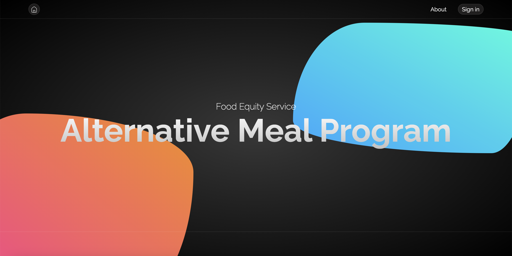

    
    <h3 align="center">Alternative Meal Program</h3>
    
Full-Stack Web Application for Food Equity at Tufts University!

 

  
Table of Contents

  <ol>
    <li>
      <a href="#about-the-project">About The Project</a>
      <ul>
        <li><a href="#built-with">Built With</a></li>
      </ul>
    </li>
    <li>
      <a href="#getting-started">Getting Started</a>
      <ul>
        <li><a href="#prerequisites">Prerequisites</a></li>
        <li><a href="#installation">Installation</a></li>
      </ul>
    </li>
    <li><a href="#usage">Usage</a></li>
    <li><a href="#roadmap">Roadmap</a></li>
    <li><a href="#contributing">Contributing</a></li>
    <li><a href="#license">License</a></li>
    <li><a href="#contact">Contact</a></li>
    <li><a href="#acknowledgments">Acknowledgments</a></li>
  </ol>

## ABOUT THE PROJECT

The Alternative Meal Program is a food equity program at Tufts University.
This repository holds the code used for the ordering service.

As someone with several lethal food allergies, this project gave me the opportunity to apply my CS knowledge to something that could impact me and people like me directly.

Features

-   Fully function user-authentication
-   CRUD interface for administrators
-   Menus integrated into the ordering page
-   Order history/editing on ordering page
-   and more...(?)

### BUILT WITH

-   [![React][React.js]][React-url]
-   [![Node.js][Node.js]][Node-url]
-   [![Express][Express]][Express-url]
-   [![MySQL][MySQL]][MySQL-url]

[React.js]: https://img.shields.io/badge/React-20232A?style=for-the-badge&logo=react&logoColor=61DAFB
[React-url]: https://reactjs.org/
[Node.js]: https://img.shields.io/badge/Node.js-339933?style=for-the-badge&logo=node-js
[Node-url]: https://nodejs.org/
[Express]: https://img.shields.io/badge/Express-000000?style=for-the-badge&logo=express&logoColor=white
[Express-url]: https://expressjs.com/
[MySQL]: https://img.shields.io/badge/MySQL-4479A1?style=for-the-badge&logo=mysql&logoColor=white
[MySQL-url]: https://www.mysql.com/
